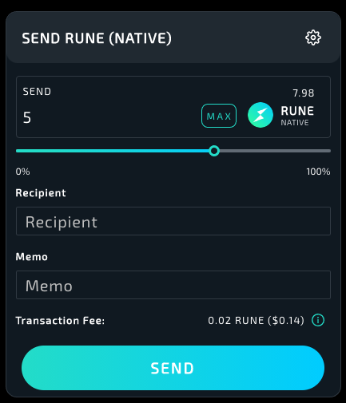
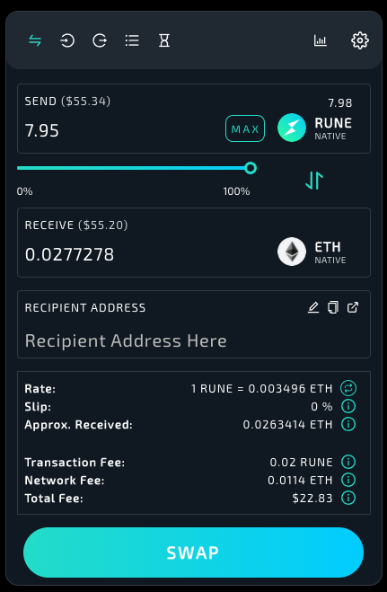

# THORChain Ledger App
### Introduction

The THORChain Ledger app is used to safely sign transactions onto the [THORChain network](https://thorchain.org). All THORChain assets are supported including:
- **RUNE Native** ("RUNE" or "THOR.RUNE")
- **Synthetic Assets** ("BTC/BTC", "ETH/ETH" etc.)

**Note**: Other Layer 1 chain assets such as Bitcoin ("BTC.BTC") and Ethereum ("ETH.ETH") require their own dedicated Ledger apps.

The THORChain app runs on the Ledger [Nano S](https://shop.ledger.com/products/ledger-nano-s) and [Nano X](https://shop.ledger.com/pages/ledger-nano-x) devices.

### Technical capabilities
Transaction messages supported are:
- **MsgSend** -- sending assets (e.g. RUNE) to another address
- **MsgDeposit** -- For interacting with the network, for example to `BOND` a THORChain validator node and perform `Swap` transactions.  

The THORChain Ledger app uses HD path `m/44'/931'/0'/0/0`

### Requirements

- Ledger Nano S device with latest firmware `v2.0.0` (or higher), or
- Ledger Nano X device with latest firmware `v1.3.0` (or higher).
- Ledger device is initialised
- Computer with [Ledger Live](https://www.ledger.com/ledger-live) installed 
- Latest Chrome (for support with Websites) or [ASGARDEX desktop app](https://github.com/thorchain/asgardex-electron/releases) installed.

### Installation

- Open the **Manager** tab in Ledger Live
- Connect and unlock your Ledger device
- If asked, Allow Ledger manager on device
- Search for **THORChain** in the App catalog
- Click **Install** and wait for it to be loaded onto device

### Usage Instructions

* [https://app.thorswap.finance](https://app.thorswap.finance)  
* [ASGARDEX Desktop](https://github.com/thorchain/asgardex-electron/releases)  

## THORSwap Support

#### Connection

- Plug in your Ledger device, unlock it and open the THORChain app.  
- On your computer, using a Chromium based browser (e.g. Brave or Chrome) load [https://app.thorswap.finance/](https://app.thorswap.finance/) and click **Connect**  
  
- Connect Chrome to Ledger:  
  
- Follow the prompts:  
  
  
**Troubleshooting** If you are having trouble connecting, try quitting other browsers or app sessions that may also be connected to the Ledger.  

#### Check Balance

Checking balance can be accomplished via the **Wallet** button, on the top right:  

#### Receive Funds

You can copy your address using the buttons in the Balance area, including displaying QR code.  
For maximum safety, you should also verify your receive address on your ledger device using the **LEDGER Connected** button as pictured:  

  

#### Sending

Tap the send button on your balance to display the send sheet:  
  
  
Enter the amount (or use the slider), and recipient address which should begin with `thor`. The `memo` field is optional.  
After pressing **SEND**, follow the prompts on your Ledger device to **verify** the transaction by pressing **accept**. If the transaction displayed on the Ledger device does not match what you entered on the website, you should choose **reject** on device.  

#### Swapping

Choose **Swap** from the main menu. The Ledger address will appear as an option to swap *to/from*.  
  
After pressing **SWAP**, follow the prompts on your Ledger device. Review the transaction including `memo` which should match your desired *SWAP* transaction details, then press **accept**. If the transaction displayed on the Ledger device does not match what you entered on the website, you should choose **reject** on device.  

## ASGARDEX Desktop Support

#### Connection  

- Plug in your Ledger device, unlock it and open the THORChain app.  
- On your computer, open the ASGARDEX app.  
- If you haven't already setup a software wallet on first run, follow the prompts to do that first.  
- Click on **WALLET** then **SETTINGS** and **ADD LEDGER**  
<kbd></kbd>  
- If you see an error such as below, your Ledger device may be locked or not have the THORChain app open. Troubleshoot and try again.  
<kbd></kbd>  
- After successfully adding the Ledger, it will appear below the software wallet account.  
<kbd></kbd>  

#### Verify Address

For maximum security, you should verify the address on the Ledger device before receiving funds. This ensures ASGARDEX is displaying the correct address.  
<kbd></kbd>  
  
  

#### Check Balance  

Checking balance can be accomplished via the **WALLET** under the **ASSETS** tab:  
<kbd></kbd>  
 

#### Receive Funds  

You can copy your address using the buttons in any part of the app that displays your Address, including the QR code button.  
For maximum security, ensure you have completed the "Verify Address" step above.  
<kbd></kbd>  

#### Sending  

Under the **WALLET** tab, choose **ASSETS** and select the appropriate row corresponding to THORCHAIN Ledger account.  
<kbd></kbd>  
Choose **SEND** to send RUNE to another address. Choose **DEPOSIT** for internal THORChain transactions such as BOND for node administration.  
<kbd></kbd>  
Enter recipient address which should begin with `thor`. Amount in RUNE. The `MEMO` field is optional.  
After pressing **SEND**, follow the prompts on your Ledger device to **verify** the transaction by pressing **accept**. If the transaction displayed on the Ledger device does not match what you entered on the website, you should choose **reject** on device.  

### Support

THORChain is a decentralised network composed of anonymous validator nodes running the chain, aligned developers contributing code and many 3rd party services built on top that use the network. There does not exist a "company" or dedicated support center. However passionate community members are always eager to assist users. For community support, please see: 
- Telegram community (https://t.me/thorchain_org)
- Twitter (https://twitter.com/thorchain_org)
- THORSwap Discord (https://discord.gg/7drEFG6STF) 
- https://docs.thorchain.org 
